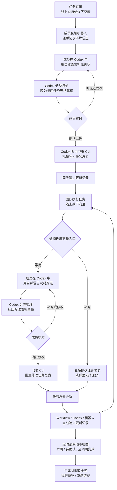

# lark-lab-task-group

[中文](README.md) | [English](README_EN.md)

一个用于科研团队的 Codex Skill：从 0 到 1 搭建飞书 / Lark 实验室任务群、任务看板、多维表格视图、群权限和机器人工作规则。

它适合学生-导师课题组、湿实验团队、样品送测协作、种苗/实验计划管理、多人进度同步等场景。

## 功能

- 使用飞书 CLI 创建或定位群聊。
- 创建多维表格任务看板。
- 配置任务总表字段、任务类别、状态、优先级。
- 创建 `更新记录` 子表，并在任务总表中显示可点击的更新历史。
- 可选配置来源感知的 Workflow：自动区分 CLI/机器人更新与成员手动修改，并可按需单独识别指定维护成员，统一写入 `更新记录`。
- 保护 `更新记录` 表：普通成员可查看，不随意编辑；只保留指定负责人和机器人/服务账号的写入权限。
- 创建常用视图：
  - 任务录入表
  - 总表（按状态排序，已完成放最后）
  - 总览看板
  - 本周任务（随日期自动切换）
  - 待老师确认
  - 负责人任务分工（按唯一负责人分组）
  - 成员参与任务（同时展示负责人和协作人）
  - 近四周已完成
- 给群聊授予看板编辑权限。
- 配置机器人任务：
  - 整理群聊里的任务
  - 辅助更新任务看板
  - 每周定时提醒和总结，并在读取失败时停止发送残缺周报
- 将老师或同学的自然语言安排整理成结构化任务记录。

## 首次使用

这个仓库可以直接被 Skill 安装器识别，但**只安装本 Skill 还不能直接操作飞书**。首次使用需要四部分：

1. Codex、Claude Code 等支持 Skill 的智能体。
2. Node.js 16 或更高版本，以及 npm/npx。
3. 飞书官方 `lark-cli` 和官方飞书配套 Skills。
4. 已配置并授权的飞书开发者应用；如需群内自动响应，还要另行创建或接入群机器人。

推荐按以下顺序安装。把 `<REPOSITORY_URL>` 替换为当前仓库页面显示的地址：

```powershell
npx @larksuite/cli@latest install
npx skills add larksuite/cli -g -y --skill lark-shared lark-base lark-drive lark-im lark-contact
npx skills add <REPOSITORY_URL> -g -y
```

这条命令只安装本模板需要的 5 个官方配套 Skill，不会安装日历、邮件、审批、会议等其他模块。安装 Skill 本身不会自动获得对应飞书权限；实际权限仍由后续账号授权决定。

安装后重启智能体，让它重新发现 Skills。然后配置和授权飞书 CLI：

```powershell
lark-cli config init
lark-cli auth login --recommend
lark-cli auth status
lark-cli doctor
```

其中 `config init` 和登录授权可能会打开浏览器，也可能需要组织管理员确认。不要把应用密钥、访问令牌、用户 ID 或多维表格 token 写进仓库或公开 Issue。

如果只想安装到当前项目，去掉 `-g` 即可。手动复制到 Skills 目录仍然可用，但不如上面的安装方式容易检查完整性。

完整的首次使用、权限边界、断点续建和排错说明见 [references/getting-started.md](references/getting-started.md)。

## 使用方式

建议第一次先让智能体只做检查，不立即创建或发送内容：

```text
使用 $lark-lab-task-group，先执行首次使用检查：确认 CLI、官方飞书配套 Skills、
账号授权、已有群/多维表格和群机器人是否就绪。列出缺失和需要我手动完成的步骤，
在我确认检查结果前不要创建或发送任何内容。
```

检查通过后，再提出完整搭建请求：

在 Codex 中提出类似请求：

```text
Use $lark-lab-task-group to set up a Feishu research group task tracker for our lab.
```

或者中文：

```text
用 $lark-lab-task-group 帮我搭建一个科研任务群，包括飞书群、任务看板、视图、权限和机器人提醒。
```

智能体会按流程完成：

1. 检查飞书 CLI 登录和权限。
2. 创建或定位群聊。
3. 创建飞书多维表格任务看板。
4. 配置字段、类别和视图。
5. 授权群成员编辑。
6. 起草机器人说明，等待确认后发到群里。
7. 把初始任务整理成表格并上传。
8. 后续更新时，主表只显示当前状态，每次更新进入 `更新记录` 存档。
9. 如允许成员直接编辑任务总表，则配置自动更新记录和权限保护。

## 推荐的日常协作流程

这套模板推荐把五个入口和空间分工清楚：

| 空间 | 主要作用 | 典型内容 |
|---|---|---|
| 私聊机器人 | 随手保存碎片记录 | 线上或线下产生的任务、进展和待确认信息 |
| Codex + 飞书 CLI | 主要整理和批量维护入口 | 用自然语言补充说明，分类转成书面表格草稿，核对后批量写入或修改 |
| 课题组群聊 | 公开协作和及时互动 | 老师布置任务、成员汇报进展、讨论卡点、确认研究安排 |
| 任务总表 | 团队当前状态的唯一事实来源 | 负责人、截止时间、状态、最新进展、交付物和研究计划 |
| 更新记录 | 自动留痕，不作为日常编辑区 | 修改时间、提交人、改前/改后状态和变更摘要 |



推荐按以下节奏运行：

1. **任务在线上线下产生**：任务可能来自群聊、私聊、会议、实验现场或线下交流，不限定单一入口。
2. **私聊机器人记录碎片**：成员先把零散任务、进展和待确认信息随手发给机器人保存，不要求机器人立即建表。
3. **在 Codex 中自然语言整理**：成员把碎片记录和补充说明交给 Codex；Codex 分类归纳并改写成书面任务表格草稿。
4. **核对后批量写入**：成员补充负责人、截止时间、交付物、研究计划和需老师确认点，明确说“上传”后，Codex 才通过飞书 CLI 批量写入任务总表。
5. **执行和更新**：常用方式是在 Codex 中用自然语言说明多项变更，由飞书 CLI 批量修改；也可以直接编辑任务总表，或在群里 `@机器人` 汇报和修改。
6. **自动形成记录**：成员手动修改主表时，由 Workflow 写入更新记录；Codex、CLI 或机器人修改时，由 Workflow 或执行方在同一次操作中归档。普通成员不要直接编辑更新记录表。
7. **集中处理老师确认**：需要老师决定的问题写成具体问句，放入“卡点/需老师确认”，并进入待老师确认视图；确认后把结论写回研究计划或最新进展并清空确认点。
8. **周报前维护日期**：成员平时持续更新进度，并在周报生成前检查当前阶段截止时间。本周任务只包含截止日期明确位于本周且尚未完成的任务。
9. **周报按三个视图生成**：机器人读取“本周任务”“待老师确认”“近四周已完成”。三个数据源全部成功后才生成；根据团队设置，先私聊指定成员预览，或直接发送到群里。

## 负责人分工与成员参与

模板将“负责”和“参与”分开表达：

- `负责人任务分工` 按唯一负责人分组，用于回答“谁对这项任务负责”。协作人仍然显示在任务行中，但不会被误算成负责人。
- `成员参与任务` 不做误导性的人员分组，同时展示负责人和协作人，可按姓名搜索或临时筛选，用于查看某位成员参与的全部任务。
- 仅靠负责人字段或用顿号、逗号连接的协作人文本，无法准确得到“每位成员各有多少项任务”。不要把这种分组称为成员工作量统计。
- 确实需要把同一任务分别计入负责人和每位协作人时，可选建一张规范化的 `成员分工表`：每个“任务-成员-角色”占一行。搭建前应确认由机器人/CLI、Workflow 还是人工维护同步，并说明 Workflow 可能增加月度运行次数。默认轻量模板不创建这张表。

成员私聊机器人记录碎片时可以这样说：

```text
请先记录这条任务碎片，不用建表，也不要上传看板：今天线下讨论了任务 A，后续还需要补充负责人和时间。
```

随后在 Codex 中可以这样说：

```text
请把下面的碎片记录和补充说明分类整理成书面任务表格草稿。先不要上传；我核对后再用飞书 CLI 写入看板。
```

群成员更新进度时可以这样说：

```text
@机器人，任务 A 今天完成了样品准备，目前等待检测。请整理更新内容并确认是否写入看板。
```

## 任务写入确认规则

当用户提供新任务或任务更新时，智能体必须先把内容整理成 Markdown 表格草稿，不能直接上传到多维表格。

推荐流程：

1. 用户给出任务原始描述。
2. 智能体整理成表格草稿。
3. 用户修改或补充。
4. 智能体再次呈现修订后的表格。
5. 只有当用户明确说“上传”“写入看板”“确认上传”等意思时，才调用飞书 CLI 写入或更新多维表格。

这个规则适用于：

- 新增任务
- 更新最新进展
- 修改负责人或协作人
- 修改截止时间
- 改变任务状态
- 添加或清空“卡点/需老师确认”
- 删除任务

如果用户只是说“整理一下”“先看看”“帮我列出来”，只输出表格草稿，不写入飞书。

## 更新记录存档规则

任务总表用于展示每个任务的当前最终状态，不承担完整历史记录功能。

推荐额外创建一张 `更新记录` 表，并在任务总表中显示一列 `更新记录`。这列是可点击的关联字段，用于查看每个任务的历次提交。

`更新记录` 表建议字段：

1. 提交标题
2. 关联任务
3. 提交类型
4. 提交内容
5. 更新前状态
6. 更新后状态
7. 提交人
8. 备注
9. 提交时间

后续每次用户确认上传更新时：

1. 更新 `任务总表` 中该任务的当前状态、最新进展、截止时间等最终字段。
2. 在 `更新记录` 表新增一条记录。
3. 将这条更新记录关联回对应任务。

这样主表保持清爽，历史过程也不会丢失。

## 自动更新记录与权限保护

如果团队成员可以直接修改 `任务总表`，建议同时启用多维表格 Workflow 自动化，让主表每次被修改时自动向 `更新记录` 写入一条记录。

搭建时应先向用户确认五件事：

1. 谁可以编辑 `任务总表`：通常是群成员或课题组成员。
2. 谁可以编辑 `更新记录`：默认只保留表格所有者、用户指定的维护成员、机器人或服务账号；普通成员只读。
3. 哪些字段变化需要写入记录：推荐至少监听状态、最新进展、卡点/需确认、负责人、协作人、截止时间、交付物、研究计划。
4. 是否需要单独识别某位指定维护成员：如需要，显示名用于审计表，稳定用户 ID 只用于 Workflow 条件；如不需要，所有手动修改都记录实际修改人。真实身份不得写入公开模板。
5. CLI/机器来源显示成什么：默认使用“飞书 CLI”或“Lark CLI”。

推荐实现方式：

1. 在 `任务总表` 增加内部字段 `状态快照` 和 `更新来源`。
2. CLI/机器人写任务时，在同一次写入中把 `更新来源` 标记为通用机器来源；成员手动修改时不写该字段。
3. Workflow 至少区分两类来源：CLI/机器人和成员手动修改；仅在用户需要特殊署名时，再增加“指定维护成员”分支。
4. 每个来源分支分别在 `更新记录` 新增一行。CLI 使用通用机器署名；手动修改使用真实成员显示名，不显示账号数字别名或内部 ID。
5. 每个来源分支各自使用独立的收尾动作，把 `状态快照` 同步为当前状态并清空 `更新来源`。
6. 在所有日常视图中隐藏 `状态快照` 和 `更新来源`。
7. 保存后必须再次读取 Workflow，确认所有已配置分支的连接实际存在且流程仍处于启用状态。不能只相信保存响应。

注意：嵌套分支可能会自动丢弃多个分支共同指向一个收尾节点的连接，因此每个来源分支都应使用功能相同但彼此独立的收尾节点。不同租户下 API/机器人写入是否触发 Workflow 也可能不同；若未触发，机器人/CLI 必须在同一次确认操作中追加 `更新记录`、同步状态快照并清空更新来源。

`更新记录` 是审计表，不建议普通成员手动编辑或删除。确需修复历史记录时，应由表格所有者、用户指定的维护成员或机器人服务账号处理，并在备注中说明修复原因。

## 依赖

本 Skill 依赖官方 `lark-cli`，以及 `lark-shared`、`lark-base`、`lark-drive`、`lark-im`、`lark-contact` 五个官方配套 Skill。它们分别负责登录授权、多维表格、云盘、群聊消息和成员身份解析。可用以下命令复查：

```powershell
lark-cli --version
lark-cli auth status
lark-cli doctor
```

常用授权域包括：

- `base`
- `drive`
- `im`
- `contact`，用于解析成员身份、负责人和权限对象

如果用户身份缺失，skill 会引导智能体通过飞书设备流授权，并显示授权链接和二维码。

## 群内机器人说明

这个 skill 会帮你设计机器人职责、生成 @ 机器人的说明话术，并把机器人纳入任务群工作流；但**群内智能机器人本体需要使用者自己创建或接入**。

请区分两个身份：

- `lark-cli` 的开发者应用和用户授权：供 Codex 等智能体通过 API 搭建和维护群、云盘与多维表格。
- 群内机器人：供成员在飞书群里 @、接收提醒和触发任务整理；它需要单独创建、拉群和授权。

两者可以由同一套后端服务连接，也可以完全独立。不要默认 CLI 安装完成就已经有群机器人，也不要把拥有高权限的 CLI 身份暴露给不受信任的群成员。

可选方式包括：

- 使用飞书 / Lark 的 Aily 类机器人或企业内已有智能体。
- 创建自定义飞书 / Lark 应用机器人，并把它拉入群聊。
- 将 Codex、Claude Code 或其他智能体通过合规的飞书应用、Webhook、MCP、Bot API 等方式接入群聊。

如果希望机器人自动读取群聊、整理任务、更新多维表格，需要额外确保：

- 机器人在目标群聊中。
- 机器人具备读取群消息和发送群消息的权限。
- 机器人或其背后的执行身份具备多维表格访问和编辑权限。
- 对新建任务、修改负责人、修改截止时间、标记完成、删除任务等关键操作，仍建议先向人类负责人确认。

如果暂时没有真正可自动执行的智能机器人，也可以先把它定位为“提醒与碎片记录助手”：由机器人保存零散信息，再由任一获授权成员在 Codex 中整理、核对并通过飞书 CLI 更新看板。

## 每周定时周报

周报默认读取三个动态视图：`本周任务`、`待老师确认`、`近四周已完成`。

其中“本周任务”是本周的明确承诺清单，不是全部未完成任务：只包含截止时间落在本周周一至周日、且状态不是“已完成”的任务。没有截止日期或截止日期在其他周的任务不会进入该部分，也不能从最新进展中的“本周”等文字推断。

科研实验常常无法预测最终完成日，因此这里的“截止时间”优先表示**当前阶段目标的承诺日期**，例如“完成本批取样”“送出样品”或“完成一次 Western”。成员应在日常工作中随时维护；最迟在周一周报生成前统一检查一次，把计划本周完成的阶段任务标上本周日期。长期项目若暂时没有明确阶段日期，可以继续保留在总表，但不会出现在本周任务中。

为避免定时任务“启动了但没有执行”或因参数错误中断，应遵守：

1. 定时提示词以“请执行以下任务”开头，写成直接操作指令，不写成大段系统角色说明。
2. 一次性替换完整提示词，不通过多条群消息拼接。
3. 使用完整 CLI 参数名，例如 `--format json`；不使用 `-o` 等含义不稳定的缩写。
4. 三个视图全部读取成功后才发群，任一失败都不发送残缺周报。
5. 每周使用去重标记，避免定时重试造成重复发送。
6. 修改定时任务时只保存配置，不立即触发运行。
7. 机器人读取“本周任务”视图后再次核验日期和状态，防止视图误配时把所有进行中任务写进周报。
8. 周数按周报日期和配置时区计算 ISO-8601 自然周，不沿用上一统计周期的周数。

完整通用提示词见 `references/weekly-automation.md`。

## 默认任务字段

任务总表默认字段顺序：

1. 任务名称
2. 任务类别
3. 负责人
4. 协作人
5. 截止时间
6. 状态
7. 最新进展
8. 卡点/需老师确认
9. 优先级
10. 交付物
11. 研究计划
12. 相关材料
13. 更新记录
14. 创建时间
15. 更新时间

如果启用自动更新记录，额外增加内部字段：

- 状态快照：用于 Workflow 记录变更前状态，默认在日常视图中隐藏。
- 更新来源：用于区分 CLI/机器人写入和成员手动修改，归档后立即清空，默认在所有日常视图中隐藏。

如果启用动态“本周任务”视图，额外增加内部字段：

- 本周标记：用 `TODAY()` 和 `WEEKDAY()` 自动判断截止时间是否属于本周，默认在所有日常视图中隐藏。
- 近四周完成标记：根据状态和更新时间判断是否属于滚动 28 天内已完成任务，默认在所有日常视图中隐藏。

## 动态视图与排序的 Bug 修复规则

“本周任务”不能使用搭建当天计算出的固定日期范围，否则进入下一周后仍会显示第一次设置时的任务。

通用模板采用以下规则：

1. 通过内部公式字段动态计算当周周一至下周一。
2. 公式返回文本“本周/非本周”，避免飞书视图接口拒绝布尔型公式筛选值。
3. “本周任务”筛选“本周标记 = 本周”。
   同时筛选“状态 != 已完成”；空截止日期不属于本周任务，且禁止从自由文本推断日期。
4. 新增“近四周已完成”视图，用滚动 28 天公式作为筛选条件。
5. 新增“总表（按状态排序）”，状态顺序保持“未开始、进行中、待老师确认、暂缓、已完成”，让已完成任务位于最后。
6. 创建内部字段后，重新检查全部视图并隐藏这些字段；总览看板需要单独验证卡片字段。

## 默认任务类别

- 文献
- 实验
- 数据
- 写作
- 会议
- 杂事
- 种苗（水培）
- 种苗（土培）
- 生化送测
- 生化
- 体系搭建
- 鉴定
- 邮寄
- 学习

## 默认状态

- 未开始
- 进行中
- 待老师确认
- 暂缓
- 已完成

## 工作原则

- 群聊用于沟通，多维表格用于记录进度。
- 任务计划写入 `研究计划`，实际执行后的变化再写入 `最新进展`。
- 每次确认后的任务更新都应追加到 `更新记录`，主表只保留当前最终状态。
- 如果允许成员直接编辑主表，应启用 Workflow 自动写入 `更新记录`，并限制 `更新记录` 的编辑权限。
- CLI/机器人更新统一使用通用机器署名；成员手动修改记录实际显示名。公开模板中不得写入真实姓名、用户名、账号数字别名或内部 ID。
- 三类更新来源都必须在归档后同步状态快照并清空更新来源。
- 有问题需要老师判断时，写入 `卡点/需老师确认`，并把状态改成 `待老师确认`。
- 当任务状态改为 `已完成` 时，默认清空 `卡点/需老师确认`，避免已完成任务继续出现在“待老师确认”视图；只有用户特别要求保留或填写时才保留。
- 普通进度可以由负责人直接更新。
- 新建任务、修改负责人、修改截止时间、标记完成、删除任务等关键操作，应先请用户或负责人确认。
- 智能体辅助录入任务时，必须先形成表格草稿，经用户确认后再上传。
- 机器人负责整理、提醒、汇总，不替人做最终判断。
- “本周任务”必须使用动态日期公式，禁止把视图固定在模板创建时的那一周。
- 总表按状态排序并把“已完成”放在最后；近四周完成任务进入独立视图供周报读取。

## 隐私

本仓库的示例已经匿名化，不包含真实人名、用户名、账号别名、邮箱、用户 ID、Base/表/视图/Workflow token、基因名、材料名、课题名或机构内部信息。

分享或二次开发时，请继续使用匿名示例，例如：

- `Student A`
- `Assistant`
- `Genotype A`
- `Material group`
- `Project Task Tracker`

## 文件结构

```text
lark-lab-task-group/
  SKILL.md
  README.md
  README_EN.md
  agents/
    openai.yaml
  references/
    getting-started.md
    base-template.md
    audit-workflow.md
    bot-brief.md
    cli-commands.md
    weekly-automation.md
```

## License

MIT，或按仓库所有者后续设置的许可证使用。
