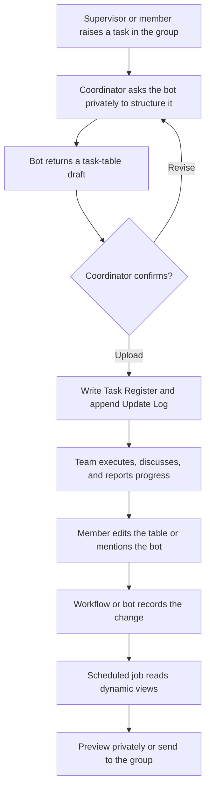

# lark-lab-task-group

[中文](README.md) | [English](README_EN.md)

A Codex skill for building a Feishu/Lark research-lab task group from zero to one, including the group workflow, Base task tracker, views, permissions, update history, bot responsibilities, and scheduled weekly reports.

It is designed for student-supervisor groups, wet-lab teams, sample-submission coordination, planting and experiment planning, and multi-person progress tracking.

## Features

- Create or locate a group chat with the Feishu/Lark CLI.
- Create a Base task tracker.
- Configure task fields, categories, statuses, and priorities.
- Create an `Update Log` table and expose clickable task history from the main table.
- Optionally configure a source-aware Workflow that distinguishes CLI/bot edits, coordinator edits, and edits by other members.
- Protect the `Update Log`: ordinary members can read it, while only selected maintainers and the bot/service account can write to it.
- Create practical views:
  - Task Entry
  - Status-Sorted Table, with completed tasks last
  - Overview Kanban
  - This Week, updated dynamically by date
  - Teacher Confirmation
  - Member Workload
  - Recent 4 Weeks Completed
- Grant the group permission to edit the task tracker.
- Configure bot responsibilities:
  - Structure tasks mentioned in chat
  - Assist with task-tracker updates
  - Produce scheduled weekly reminders and summaries
  - Stop instead of sending a partial report when a required read fails
- Convert free-form instructions from supervisors or team members into structured task records.

## First-Time Setup

The skill installer can discover this repository directly, but **installing this skill alone does not provide Feishu/Lark API access**. A first-time setup needs four parts:

1. A skill-capable agent such as Codex or Claude Code.
2. Node.js 16 or newer with npm/npx.
3. The official `lark-cli` and official Lark companion skills.
4. A configured and authorized Feishu/Lark developer app. A separately created or connected group bot is also required for in-chat automation.

Install in this order. Replace `<REPOSITORY_URL>` with the URL shown on this repository page:

```powershell
npx @larksuite/cli@latest install
npx skills add larksuite/cli -g -y --skill lark-shared lark-base lark-drive lark-im
npx skills add <REPOSITORY_URL> -g -y
```

Install `lark-contact` separately when member-name resolution is needed:

```powershell
npx skills add larksuite/cli -g -y --skill lark-contact
```

Restart the agent after installation so it discovers the new skills. Then configure and authorize Lark CLI:

```powershell
lark-cli config init
lark-cli auth login --recommend
lark-cli auth status
lark-cli doctor
```

Configuration and login may open a browser or require organization approval. Never commit app secrets, access tokens, user IDs, or Base tokens, and never post them in a public issue.

Omit `-g` for a project-local installation. A manual clone into an agent's skills directory remains a fallback, but the skill installer provides clearer discovery and layout validation.

See [references/getting-started.md](references/getting-started.md) for the full first-use checklist, component boundaries, resumable setup rules, and troubleshooting.

## Usage

For the first run, ask the agent to perform only the preflight before it creates or sends anything:

```text
Use $lark-lab-task-group. Run the first-use preflight first. Verify the CLI,
official Lark companion skills, authorization, existing group/Base resources,
and group-bot availability. Show me any missing or manual steps. Do not create
or send anything until I confirm the setup summary.
```

After the preflight passes, ask for the full setup:

Ask Codex to use the skill:

```text
Use $lark-lab-task-group to set up a Feishu research group task tracker for our lab.
```

The agent will:

1. Check Feishu/Lark CLI authentication and permissions.
2. Create or locate the group chat.
3. Create the Base task tracker.
4. Configure fields, categories, and views.
5. Grant edit access to the intended group members.
6. Draft the bot brief and wait for approval before sending it.
7. Convert initial tasks into a preview table and upload them only after confirmation.
8. Keep only the current task state in the main table while archiving every change in `Update Log`.
9. Configure automatic audit logging and permission protection when members may edit the main table directly.

## Recommended Daily Collaboration

The template works best when four spaces have distinct responsibilities:

| Space | Main purpose | Typical content |
|---|---|---|
| Private bot chat | Drafting, preview, and approval for high-impact operations | Bulk task intake, field changes, deletion, permissions, and weekly-report preview |
| Lab group chat | Transparent collaboration and timely interaction | Supervisor instructions, progress reports, blockers, and research decisions |
| Task Register | The single source of truth for current team state | Owners, deadlines, status, latest progress, deliverables, and research plans |
| Update Log | Automatic audit trail, not a routine editing surface | Time, submitter, previous/new status, and change summary |



Recommended operating rhythm:

1. **Tasks enter through the group**: supervisors or members state assignments where context and responsibility are visible to everyone.
2. **Draft privately**: the coordinator asks the bot to turn scattered messages into a table. The bot does not upload or send to the group yet.
3. **Write after confirmation**: the coordinator completes owners, deadlines, deliverables, research plans, and teacher-confirmation questions. The bot writes only after an explicit upload instruction.
4. **Execute and update**: members may edit `Task Register` directly or mention the bot in the group. Routine progress can be organized normally; creation, deletion, completion, owner changes, and deadline changes require confirmation.
5. **Record every change**: Workflow logs manual main-table edits. Bot or CLI writes are logged by Workflow or appended by the bot in the same operation. Ordinary members do not edit `Update Log` directly.
6. **Resolve teacher confirmations**: write a concrete question in the blocker/confirmation field and expose it in the confirmation view. After a decision, record the conclusion in the research plan or latest progress and clear the confirmation field.
7. **Maintain dates before reporting**: members keep progress current and review current-stage deadlines before report generation. `This Week` includes only unfinished tasks with explicit deadlines in the current week.
8. **Build reports from three views**: read `This Week`, `Teacher Confirmation`, and `Recent 4 Weeks Completed`. Generate a report only when all three reads succeed, then either preview it privately or send it to the group according to team settings.

Example private message:

```text
Turn the following instructions into a task-table draft. Do not upload yet.
I will confirm before you write to the tracker.
```

Example group update:

```text
@Bot, Task A completed sample preparation today and is now waiting for testing.
Please structure the update and confirm whether it should be written to the tracker.
```

## Draft-First Task Writes

When a user provides a new task or an update, the agent must first produce a Markdown table for review. It must not immediately write to Base.

Recommended flow:

1. The user provides a free-form task description.
2. The agent converts it into a structured table draft.
3. The user edits or supplements the draft.
4. The agent presents the revised table again.
5. The agent writes to Base only after explicit confirmation such as `upload`, `write to the tracker`, or `confirm upload`.

This rule applies to:

- Creating tasks
- Updating latest progress
- Changing owners or collaborators
- Changing deadlines
- Changing task status
- Adding or clearing teacher-confirmation items
- Deleting tasks

If the user only asks to organize, preview, or list the information, return a draft and do not write to Feishu/Lark.

## Update History

The main task table should show the current final state of each task. It should not serve as the full historical archive.

Create a separate `Update Log` table and add a linked `Update Log` field to the main table. Team members can open that field to inspect every submitted change for a task.

Recommended `Update Log` fields:

1. Update Title
2. Linked Task
3. Update Type
4. Update Content
5. Previous Status
6. New Status
7. Submitted By
8. Notes
9. Submitted Time

For each confirmed update:

1. Update the final fields in the main task row.
2. Append a row to `Update Log`.
3. Link the new log row back to the task.

This keeps the main table readable without losing the experimental history.

## Automatic Audit Logging and Permissions

When team members can edit the main task table directly, enable a Base Workflow that automatically appends a row to `Update Log` whenever a tracked field changes.

Confirm these decisions with the user during setup:

1. Who can edit the main task table, usually the lab or group members.
2. Who can edit `Update Log`, normally the coordinator, owner, bot, or service account; ordinary members should be read-only.
3. Which field changes must be archived. At minimum, consider status, latest progress, teacher confirmation, owner, collaborators, deadline, deliverable, and research plan.
4. The coordinator's display name and stable user ID. The display name is used in the audit table; the ID is used only in Workflow conditions and must not be committed to the reusable template.
5. The label for machine edits, such as `Feishu CLI` or `Lark CLI`.

Recommended implementation:

1. Add internal `Status Snapshot` and `Update Source` fields to the main task table.
2. CLI/bot writes set `Update Source` in the same task update; manual edits leave it empty.
3. Split the Workflow into three branches: CLI/bot, the designated coordinator, and other members.
4. Each branch creates its own `Update Log` row. Machine edits use a generic machine label; manual edits use the member's display name rather than a numeric account alias or internal ID.
5. Each branch has its own cleanup step that syncs `Status Snapshot` and clears `Update Source`.
6. Hide both internal fields from all routine views.
7. Read the Workflow definition back after saving and verify that all branch links remain present and the Workflow is enabled.

Nested Workflow branches may drop a shared cleanup node. This template therefore uses three equivalent but independent cleanup nodes. API or bot writes may not trigger Workflow in every tenant. When they do not, the bot or CLI operation must append the update-log row, sync the status snapshot, and clear the update source in the same confirmed operation.

Treat `Update Log` as an audit table. Ordinary members should not manually edit or delete it. Repairs should be performed by the owner, coordinator, or bot/service account and documented in the notes.

## Requirements

This skill requires the official `lark-cli` and the official `lark-shared`, `lark-base`, `lark-drive`, and `lark-im` companion skills. `lark-contact` is optional and used for member identity resolution. Recheck the CLI with:

```powershell
lark-cli --version
lark-cli auth status
lark-cli doctor
```

Common authorization domains:

- `base`
- `drive`
- `im`
- `contact`, optional, for resolving member identities

If user identity is unavailable, the skill guides the agent through Feishu/Lark device-flow authorization and displays the authorization link and QR code.

## Group Bot

This skill defines the bot's responsibilities, drafts the bot brief, and integrates the bot into the group workflow. The user must still create or connect the intelligent bot itself.

Keep these two identities distinct:

- The `lark-cli` developer app and user authorization let Codex or another agent build and maintain groups, Drive resources, and Base data through APIs.
- The group-facing bot is mentioned by members, sends reminders, and may trigger task organization. It must be created, invited, and authorized separately.

They may share a backend integration or remain independent. Do not assume that installing the CLI creates a group bot, and do not expose a high-permission CLI identity to an untrusted group.

Possible bot implementations include:

- A Feishu/Lark Aily-style bot or an existing organization agent
- A custom Feishu/Lark app bot invited to the group
- Codex, Claude Code, or another agent connected through an approved Feishu/Lark app, webhook, MCP service, or Bot API integration

For automatic chat reading and Base updates, verify that:

- The bot is a member of the target group.
- The bot can read and send group messages.
- The bot or its execution identity can access and edit the Base.
- High-impact actions still require human confirmation, including task creation, owner or deadline changes, completion, and deletion.

Without a fully executable bot, use it as a reminder and drafting assistant: the bot proposes structured changes and a human coordinator approves and applies them.

## Scheduled Weekly Report

The default report reads three dynamic views:

- `This Week`
- `Teacher Confirmation`
- `Recent 4 Weeks Completed`

`This Week` is a dated commitment list, not a list of all open tasks. It contains only non-completed tasks with explicit deadlines from the current Monday through Sunday. Tasks with blank deadlines or deadlines outside the week are excluded. The bot must never infer weekly membership from phrases such as `finish this week` in free-text progress or plan fields.

Research experiments often do not have a predictable final completion date. In this workflow, `Deadline` should usually represent the committed date for the current stage, for example completing one sampling batch, sending samples, or completing one assay. Members should update these dates during normal work and, at minimum, review them before the scheduled Monday report. Long-running projects without a current-stage commitment remain in the main table but do not appear in `This Week`.

Weekly-report safeguards:

1. Begin the scheduled prompt with a direct instruction such as `Please execute the following task`.
2. Replace the full prompt in one operation; do not assemble it from multiple chat messages.
3. Use complete CLI flags such as `--format json`; avoid ambiguous shorthand such as `-o`.
4. Send a report only after all three views have been read successfully.
5. Use a weekly deduplication marker to prevent duplicate messages after retries.
6. Updating the scheduled task must save the configuration without immediately running it.
7. Revalidate the dates and status of every `This Week` record after reading the view.
8. Calculate any displayed week number using ISO-8601 in the configured timezone; never reuse the previous reporting period's week number.

See `references/weekly-automation.md` for the reusable scheduled prompt.

## Default Task Fields

Recommended main-table field order:

1. Task Name
2. Task Category
3. Owner
4. Collaborators
5. Deadline
6. Status
7. Latest Progress
8. Teacher Confirmation / Blocker
9. Priority
10. Deliverable
11. Research Plan
12. Related Materials
13. Update Log
14. Created Time
15. Updated Time

Internal fields for automatic audit logging:

- `Status Snapshot`: stores the previous status for Workflow logging; hidden from routine views.
- `Update Source`: distinguishes CLI/bot writes from manual edits; cleared after archiving and hidden from routine views.

Internal fields for dynamic weekly views:

- `Current Week Marker`: uses `TODAY()` and `WEEKDAY()` to determine whether the deadline is in the current week.
- `Recent Completion Marker`: identifies completed tasks updated during the rolling previous 28 days.

## Dynamic View Safeguards

Do not configure `This Week` with fixed dates calculated on the setup day. That would leave the view frozen on its first week.

The reusable template follows these rules:

1. An internal formula calculates the range from the current Monday to the next Monday.
2. The formula returns text such as `This Week` or `Not This Week`, avoiding Boolean formula-filter incompatibilities.
3. The view filters for `Current Week Marker = This Week` and `Status != Completed`.
4. Blank deadlines are not current-week tasks, and free text never substitutes for a date.
5. `Recent 4 Weeks Completed` uses a rolling 28-day formula.
6. `Status-Sorted Table` keeps the option order active-first and `Completed` last.
7. After adding internal fields, visible-field lists are reapplied to every routine view; kanban cards are checked separately.

## Default Task Categories

- Literature
- Experiment
- Data
- Writing
- Meeting
- Administration
- Seedling / Hydroponics
- Seedling / Soil
- Biochemical Submission
- Biochemistry
- System Setup
- Identification
- Shipping
- Training

Adapt the labels to the team's language and research workflow.

## Default Statuses

- Not Started
- In Progress
- Teacher Confirmation
- Paused
- Completed

## Operating Principles

- Use group chat for discussion and Base for durable task state.
- Put designs and planned procedures in `Research Plan`; write actual execution changes in `Latest Progress`.
- Append every confirmed change to `Update Log`; keep only the current final state in the main table.
- When members can edit the main table directly, enable automatic audit logging and protect the log table from ordinary edits.
- Use a generic machine label for CLI/bot writes and the actual display name for manual edits. Never place numeric account aliases or stable internal IDs in reusable templates.
- Every audit branch must sync the status snapshot and clear the update source.
- When a task becomes `Completed`, clear the teacher-confirmation/blocker field by default unless the user explicitly asks to preserve it.
- Owners may update routine progress directly.
- Ask for confirmation before creating tasks, changing owners or deadlines, marking completion, or deleting tasks.
- Always use the draft-first loop for agent-assisted task entry.
- The bot organizes, reminds, and summarizes; it does not make final research decisions for the team.
- Keep `This Week` dynamic and date-driven.
- Keep completed work last in the status-sorted table and use the rolling completed view for weekly reports.

## Privacy

The repository uses anonymous examples. It must not contain real names, usernames, numeric account aliases, email addresses, stable user IDs, Base/table/view/Workflow tokens, unpublished gene or material names, project names, or institution-specific information.

Continue using neutral placeholders when sharing or extending the skill:

- `Student A`
- `Assistant`
- `Genotype A`
- `Material group`
- `Project Task Tracker`

## Repository Structure

```text
lark-lab-task-group/
  SKILL.md
  README.md
  README_EN.md
  agents/
    openai.yaml
  references/
    getting-started.md
    base-template.md
    audit-workflow.md
    bot-brief.md
    cli-commands.md
    weekly-automation.md
```

## License

MIT, or another license selected by the repository owner.
